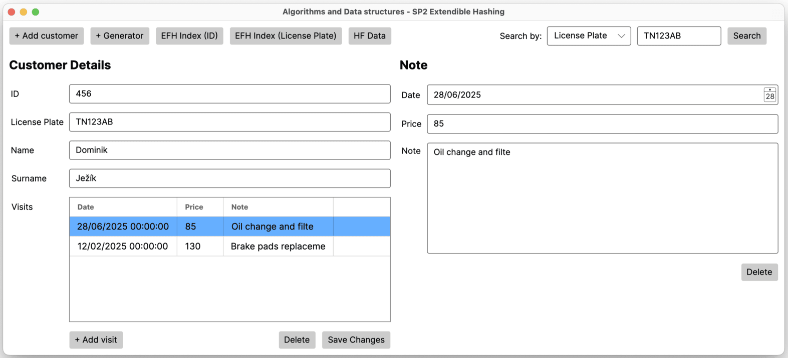
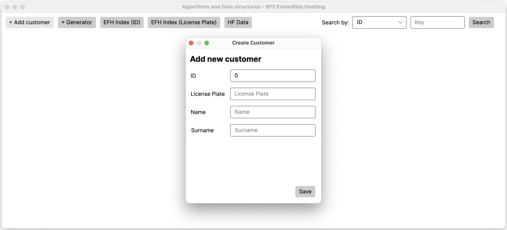
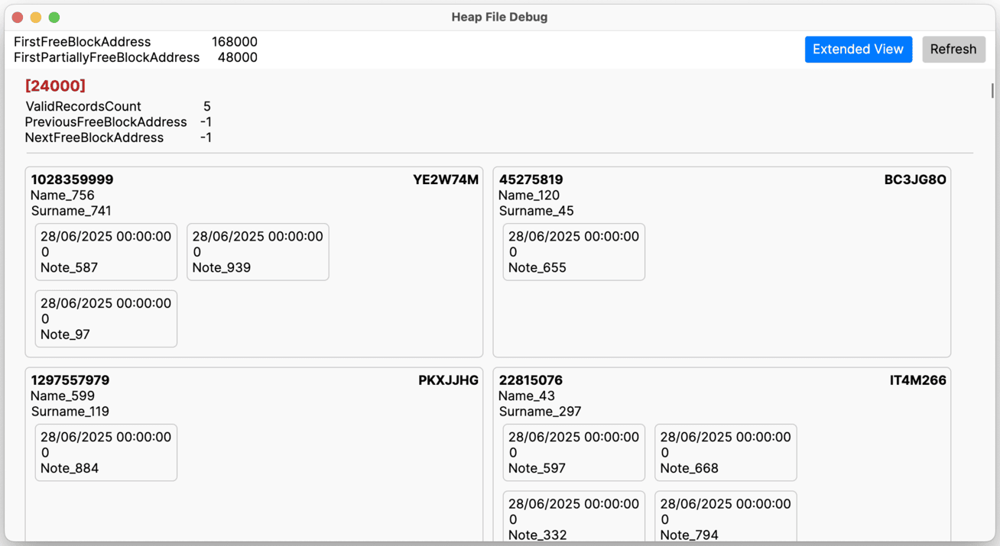
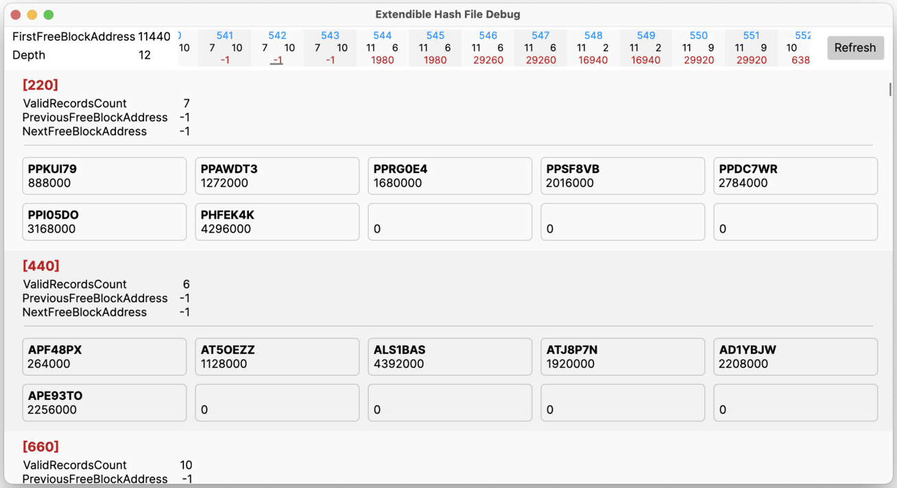
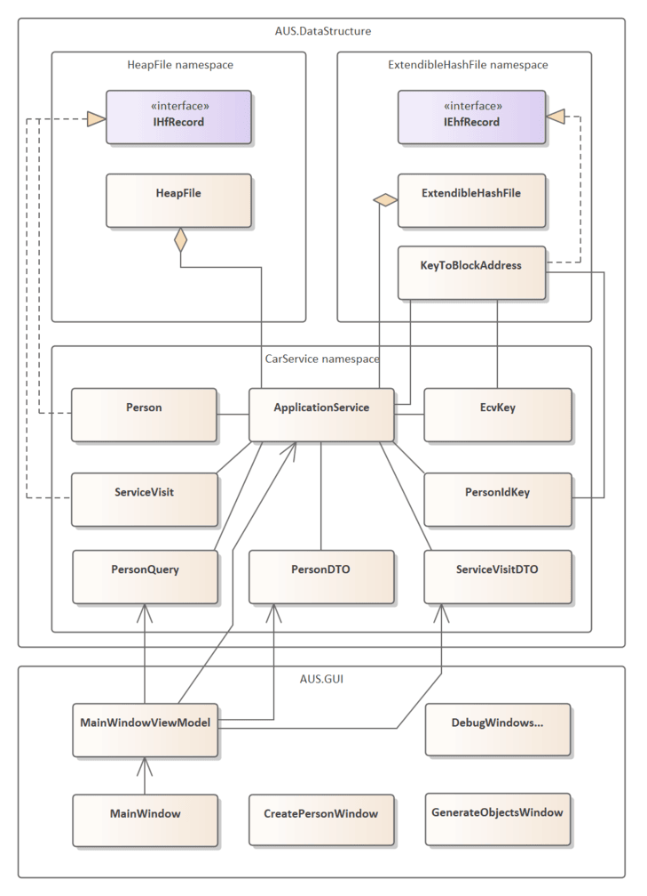

# 🗃️ Extendible Hash File + Heap File Data Structures
Custom implementation of **Extendible Hash File** and **Heap File** data structures which are designed for saving and managing data in files (same principle as database systems). Structures are used in a **Car service application** for managing customers and their vehicles, while providing fast access to data using extendible hashing indexes. Data are always stored in files, which are read and written as byte arrays only when we are performing operations on them (useful when we are short on operating memory). The application is written in C# using .NET and Avalonia for the GUI.

The application was developed as the second semester work on the Algorithms and Data structures 2 course at the Faculty of Management Science and Informatics of the University of Žilina.

## 📄 Heap File
Heap File allows storing records in binary form of fixed-size blocks. Each block can contain multiple records, and the structure supports operations such as insertion, deletion, and retrieval of records. The Heap File is designed to efficiently manage free space and partially free blocks in middle of the file, allowing for dynamic growth and shrinkage of the file as records are added or removed.

## 🗂️ Extendible Hash File
Extendible Hash File is a hash-based data structure that allows efficient indexing and retrieval of records based on keys. It uses a directory structure to manage blocks of records, allowing for dynamic resizing of the hash table as the number of records grows. The Extendible Hash File supports operations such as insertion, deletion, and retrieval of records, while maintaining the properties of a hash table.

## 🌟 Features
- ✅ **Efficient Data Management**: Custom implementations of Heap File and Extendible Hash File for managing records in a car service application.
- ✨ **Dynamic Resizing**: Both structures support dynamic resizing, allowing for efficient use of disk space.
- 🚀 **Fast Access**: Extendible Hash File provides fast access to records using hash-based indexing
- 🐞 **Debugging Tools**: Integrated debugging tools for inspecting the state of data structures, control blocks, and in-memory blocks.
- 👨🏻‍💻 **User-Friendly GUI**: User-friendly interface built with Avalonia for easy interaction with the data structures.
- 🧪 **Test Cases**: Data structures are tested by automated random operations generator for detecting implementation errors including dynamic resizing and free space management.

## 🚗 Car Service Application
The application is designed to manage customers with their vehicles and service visits. It allows users to perform operations such as adding, updating, and deleting customer records, as well as managing service visits. The application uses the custom data structures to efficiently store and retrieve customer and vehicle information. Data are stored in persistent files like a database system.

 

<em>
    Main application window that allows searching by ID or license plate in top right corner. The left side displays found customer information and list of service visits. The right side displays information about the selected service visit.
</em>

<em>
    Window for generating random customers with service visits, which can be used for testing the application. It is possible to set the number of customers and minimum and maximum number of service visits per customer.
</em>

<em>
    Window for adding new customers.
</em>

## 🔍 Searching and Retrieving Records
The process of retrieving a customer's data follows these steps:
1. 🧭 **Choose Search Method**  
   The user selects whether to search by **Customer ID** or **License Plate** and provides the corresponding value.
2. 📍 **Find Address via Index**  
   The application uses the two **Extendible Hash Files** as an index structures to look up the provided key and retrieve the **address** of the corresponding record in the **Heap File**.
3. 📄 **Retrieve Record from Heap File**  
   Using the found address, the application accesses the **Heap File** and loads the full **customer record**, including personal information, vehicle details, and service history.

 

<em>
    Search flow diagram illustrating the process of searching for a customer record by ID or license plate through all used data structures.
</em>

## 🕵🏻‍♂️ Debugging Tools
The application includes a debugging tool that allows users to inspect the current state of the data structures, including control blocks and in-memory blocks. This tool is useful for verifying the correctness of the implementation and debugging issues related to data management.

### Heap File Debug Window
- In top left corner are control information about the heap file:
  - adress of free blocks chain
  - adress of partially free blocks chain
- Red number is address of the block in the heap file
- Each block contains own control information:
  - valid records count 
  - variables for managing chains - previous and next addresses
- In this example each block contains up to 5 records (customers)
- Each record has ID and License Plate as primary unique keys and other attributes

 

### Extendible Hash File Debug Window
- In top left corner are control information about the extendible hash file:
  - adress of free blocks chain
  - depth of the directory
- In top part is also Directory with addresses of blocks (red numbers), depth of the block (left black number), valid records count (right black number) and sequence number (blue number)
- Red number is address of the block in the extendible hash file
- Each block contains own control information:
  - valid records count 
  - variables for managing chains - previous and next addresses
- In this example each block contains up to 10 records (address to the heap file blocks with customers)
- This example indexes by License Plate

 

## 🛠️ Program Architecture

    
    

        <em>Simplyfied class diagram of the program architecture</em>
    

## 📚 Documentation
[📘 Detailed semester work documentation](docs/documentation.pdf) includes details about:
- Usage of data structures
- Heap File operations (insert, delete, search), their implementation and calculated complexity
- Extendible Hash File operations (insert, delete, search), their implementation and calculated complexity
- Architecture of the application
- Aplication features and their complexities

 
 
 

# 🗃️ Rozšíriteľné hashovanie + Heap File údajové štruktúry
Vlastná implementácia dátových štruktúr **Rozšíriteľného hashovacieho súboru** a **Heap File** určených na ukladanie a správu údajov v súboroch (rovnaký princíp ako databázové systémy). Štruktúry sa používajú v aplikácií **Auto servis** na správu zákazníkov a ich vozidiel, pričom poskytujú rýchly prístup k údajom pomocou indexov rozšíriteľného hashovania. Údaje sú vždy uložené v súboroch, ktoré sa čítajú a zapisujú ako pole bajtov iba pri vykonávaní operácií nad nimi (užitočné pri nedostatku operačnej pamäte). Aplikácia je napísaná v C# pomocou .NET a Avalonia pre GUI.

Aplikácia bola vytvorená ako druhá semestrálna práca v rámci predmetu Algoritmy a údajové štruktúry 2 na Fakulte riadenia a informatiky Žilinskej univerzity v Žiline.

## 📄 Heap File
Heap File umožňuje ukladať záznamy v binárnej forme do blokov pevnej veľkosti. Každý blok môže obsahovať viacero záznamov a štruktúra podporuje operácie ako vkladanie, mazanie a vyhľadávanie záznamov. Heap File je navrhnutý tak, aby efektívne spravoval voľný priestor a čiastočne voľné bloky v strede súboru, čo umožňuje dynamický rast a zmenšovanie súboru pri pridávaní alebo odstraňovaní záznamov.

## 🗂️ Rozšíriteľné hashovanie
Rozšíriteľné hashovanie je údajová štruktúra založená na hashovaní, ktorá umožňuje efektívne indexovanie a vyhľadávanie záznamov na základe kľúčov. Používa adresárovú štruktúru na správu blokov záznamov, čo umožňuje dynamické zväčšovanie hashovacej tabuľky pri raste počtu záznamov. Rozšíriteľné hashovanie podporuje operácie ako vkladanie, mazanie a vyhľadávanie záznamov, pričom zachováva vlastnosti hashovacej tabuľky.

## 🌟 Funkcie
- ✅ **Efektívna správa údajov**: Vlastné implementácie Heap File a Rozšíriteľného hashovacieho súboru pre správu záznamov v aplikácií auto servisu.
- ✨ **Dynamické zväčšovanie**: Obe štruktúry podporujú dynamickú zmenu veľkosti, čo umožňuje efektívne využitie diskového priestoru.
- 🚀 **Rýchly prístup**: Rozšíriteľné hashovanie poskytuje rýchly prístup k záznamom pomocou indexovania založeného na hashovaní.
- 🐞 **Ladiace nástroje**: Integrované ladiace nástroje na kontrolu stavu dátových štruktúr, riadiacich blokov a blokov v pamäti.
- 👨🏻‍💻 **Používateľsky prívetivé GUI**: Používateľsky prívetivé rozhranie postavené na Avalonii pre jednoduchú interakciu s údajovými štruktúrami.
- 🧪 **Testovacie prípady**: Údajové štruktúry sú testované automatickým generátorom náhodných operácií na detekciu chýb implementácie vrátane dynamického zväčšovania a správy voľného priestoru.

## 🚗 Aplikácia Auto Servis
Aplikácia je navrhnutá na správu zákazníkov s ich vozidlami a návštevami servisu. Umožňuje používateľom vykonávať operácie ako pridávanie, aktualizáciu a mazanie záznamov zákazníkov, ako aj správu návštev servisu. Aplikácia používa vlastné údajové štruktúry na efektívne ukladanie a získavanie informácií o zákazníkoch a vozidlách. Údaje sú uložené v trvalých súboroch podobne ako v databázovom systéme.

 

<em>
    Hlavné okno aplikácie, ktoré umožňuje vyhľadávanie podľa ID alebo EČV v pravom hornom rohu. Ľavá strana zobrazuje informácie o nájdenom zákazníkovi a zoznam návštev servisu. Pravá strana zobrazuje informácie o vybranej návšteve servisu.
</em>

<em>
    Okno na generovanie náhodných zákazníkov s návštevami servisu, ktoré je možné použiť na testovanie aplikácie. Je možné nastaviť počet zákazníkov a minimálny a maximálny počet návštev servisu na zákazníka.
</em>

<em>
    Okno na pridanie nových zákazníkov.
</em>

## 🔍 Vyhľadávanie a získavanie záznamov
Proces získavania údajov o zákazníkovi prebieha v týchto krokoch:
1. 🧭 **Výber metódy vyhľadávania**  
    Používateľ si vyberie, či chce vyhľadávať podľa **ID zákazníka** alebo **EČV** a zadá príslušnú hodnotu.
2. 📍 **Nájdenie adresy pomocou indexu**
    Aplikácia používa dva **Rozšíriteľné hashovacie súbory** ako indexové štruktúry na vyhľadanie zadaného kľúča a získanie **adresy** príslušného záznamu v **Heap File**.
3. 📄 **Získanie záznamu z Heap File**
    Pomocou nájdenej adresy aplikácia pristupuje k **Heap File** a načíta celý **záznam zákazníka**, vrátane osobných údajov, informácií o vozidle a histórie návštev servisu.

 

<em>
    Postup vyhľadávania ilustrujúci proces vyhľadávania záznamu zákazníka podľa ID alebo EČV cez všetky použité údajové štruktúry.
</em>

## 🕵🏻‍♂️ Ladiace nástroje
Aplikácia obsahuje ladiaci nástroj, ktorý umožňuje používateľom kontrolovať aktuálny stav dátových štruktúr, vrátane riadiacich blokov a blokov v pamäti. Tento nástroj je užitočný na overenie správnosti implementácie a ladenie problémov súvisiacich so správou údajov.

### Heap File Ladiace okno
- V ľavom hornom rohu sú riadiace informácie o heap file:
  - adresa reťazca voľných blokov
  - adresa reťazca čiastočne voľných blokov
- Červené číslo je adresa bloku v heap file
- Každý blok obsahuje vlastné riadiace informácie:
  - počet platných záznamov 
  - premenné na správu reťazcov - adresa predchádzajúceho a nasledujúceho bloku
- V tomto príklade môže každý blok obsahovať až 5 záznamov (zákazníkov)
- Každý záznam má ID a EČV ako primárne unikátne kľúče a ďalšie atribútyň

 

### Rozšíriteľné hashovanie Ladiace okno
- V ľavom hornom rohu sú riadiace informácie o rozšíriteľnom hashovacom súbore:
  - adresa reťazca voľných blokov
  - hĺbka adresára
- V hornej časti je tiež adresár s adresami blokov (červené čísla), hĺbkou bloku (ľavé čierne číslo), počtom platných záznamov (pravé čierne číslo) a poradovým číslom (modré číslo)
- Červené číslo je adresa bloku v rozšíriteľnom hashovovaní
- Každý blok obsahuje vlastné riadiace informácie:
  - počet platných záznamov 
  - premenné na správu reťazcov - adresa predchádzajúceho a nasledujúceho bloku
- V tomto príklade môže každý blok obsahovať až 10 záznamov (adresy blokov v heap file so zákazníkmi)
- Tento príklad indexuje podľa EČV

 

## 🛠️ Architektúra programu

    
    

        <em>Zjednodušený diagram tried architektúry programu</em>
    

## 📚 Dokumentácia
[📘 Podrobná dokumentácia semestrálnej práce](docs/documentation.pdf) obsahuje podrobnosti o:
- Použití údajových štruktúrach
- Operáciách Heap File (vkladanie, mazanie, vyhľadávanie), ich implementácii a vypočítanej zložitosti
- Operáciách Rozšíriteľného hashovacieho súboru (vkladanie, mazanie, vyhľadávanie), ich implementácii a vypočítanej zložitosti
- Architektúre aplikácie
- Funkciách aplikácie a ich zložitosti
